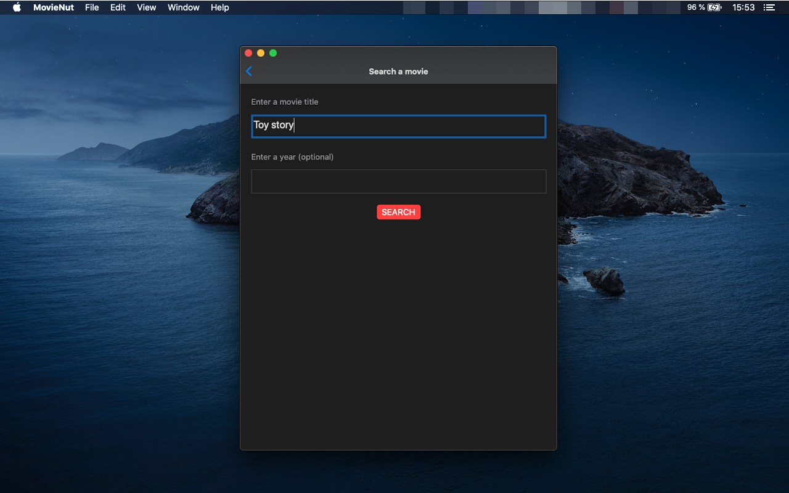
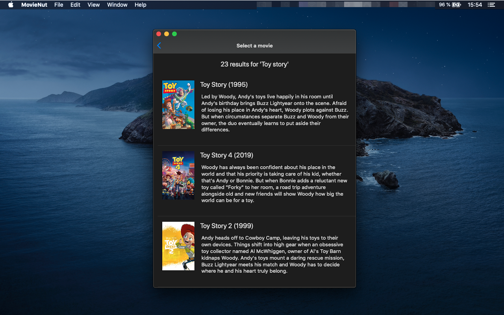
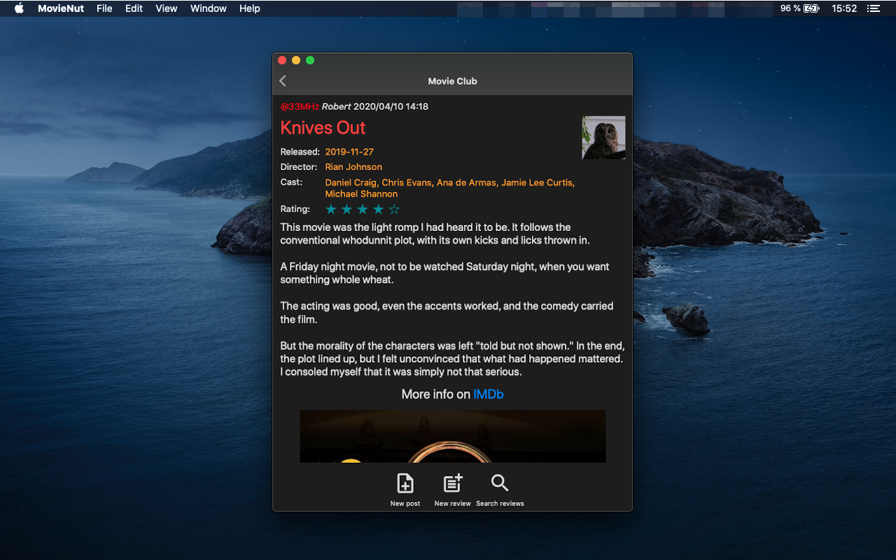
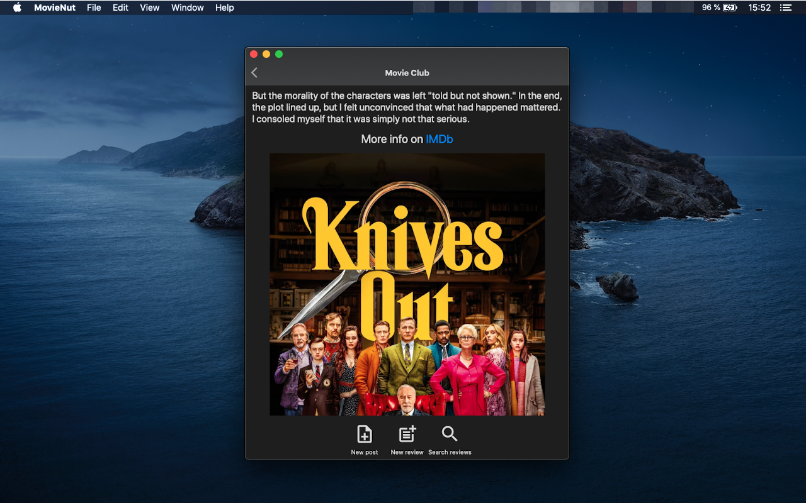

# MovieNut

With MovieNut you can search for films and post reviews to [Pnut.io](http://pnut.io/)'s Movie Club channel. 

You can also interact with other user's posts and reviews.

## Get It

It's free!

[Android version on the Google Play Store](https://play.google.com/store/apps/details?id=io.aya.movienut)

[macOS 10.15+ version direct link](MovieNut_107_Catalina.zip)

## Screenshots

### Android

### macOS

## How Does It Work

- Log in with your Pnut account

### Create A Movie Review

- Tap/click the "Search" menu
- Type (part of) a movie title
- Type the year of its release (optional)
- Select the movie in the candidates list
- Rate the movie
- Write a review
- Post to Pnut

### Browse The Movie Club Channel

- Tap/click on the Movie Club menu
- Browse messages and reviews
- Open discussion threads
- Post messages
- Reply to messages
- Search for reviews (yours/all)

